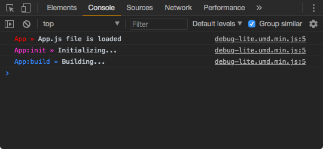

# Debug Lite

A very tiny Javascript debugging utility. It's a lite version of [debug](https://github.com/visionmedia/debug) but only for use on browsers.


## Installation

```bash
$ npm install debug-lite
```


## Usage

For browser globals:
- Using `debug-lite.umd.min.js` file and use `window.debugLite.createDebug` function.

For bundlers like Webpack or Browserify:
- Using as module `import { createDebug } from 'debug-lite'`

```js
// import { createDebug } from 'debug-lite';
const createDebug = require('debug-lite').createDebug;

const log = createDebug('App');
const logInit = createDebug('App:init');
const logBuild = createDebug('App:build');

function init() {
  logInit('Initializing...');
}

function build() {
  logBuild('Building...');
}

function main () {
  log('app.js file is loaded');

  init();
  build();
}

main();
```
Open console and try:

```js
localStorage.DEBUG = '*';
location.reload();
```


You can found a complete example [here](example/README.md).


## License

MIT