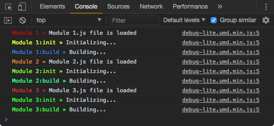
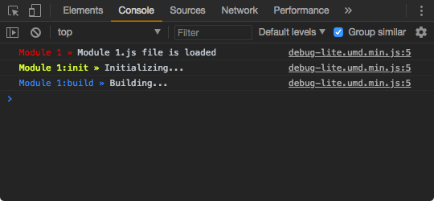
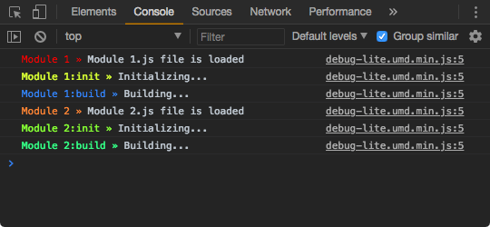
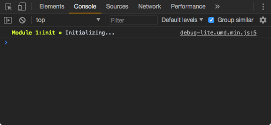
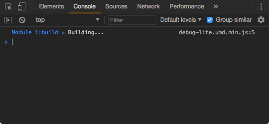
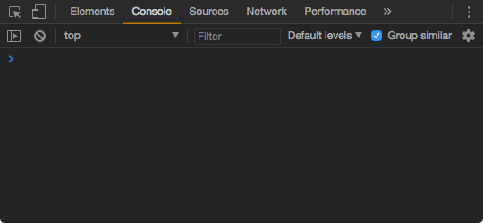

# Debug Lite » Example

Open index.html in your browser, open console and try:

» Show all messages
```js
localStorage.DEBUG = '*';
location.reload();
```


» Show all messages that start with namespace 'Module 1:'
```js
localStorage.DEBUG = 'Module 1:*';
location.reload();
```


» Show all messages with namespace 'Module 1:' and 'Module 2:'
```js
localStorage.DEBUG = 'Module 1:*,Module 2:*';
location.reload();
```


» Show only messages with namespace 'Module 1:init'
```js
localStorage.DEBUG = 'Module 1:init';
location.reload();
```


» Show only messages with namespace 'Module 1:build'
```js
localStorage.DEBUG = 'Module 1:build';
location.reload();
```


» Hide all messages
```js
localStorage.removeItem('DEBUG');
location.reload();
```



## License

MIT